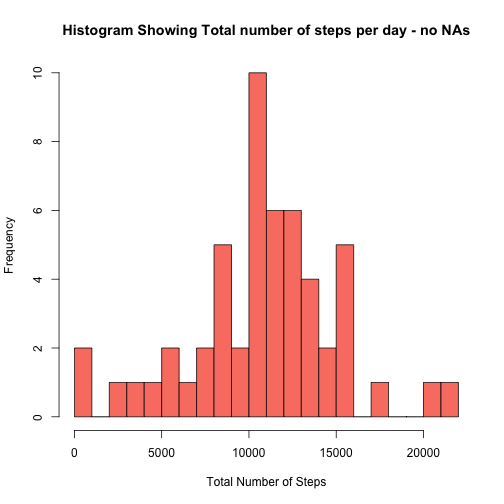
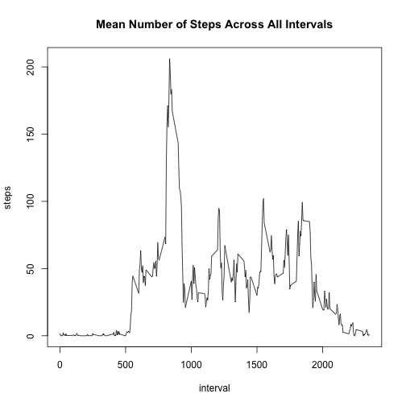
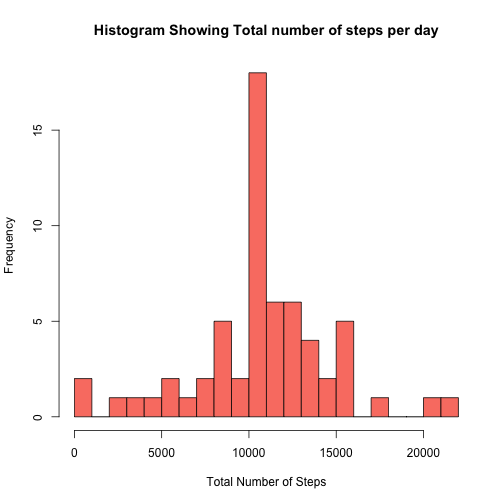
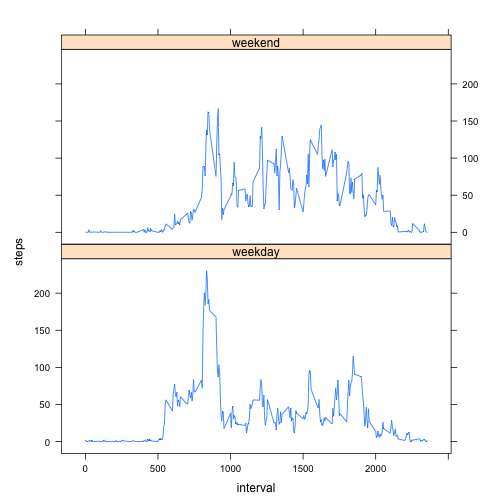

## Loading and preprocessing the data

```r
my.data <- read.csv(file = "activity.csv", header = TRUE, sep = ",",
      na.strings = "NA", nrows = 17568)

my.data$date <- as.Date(my.data$date)

str(my.data)
```

```
## 'data.frame':	17568 obs. of  3 variables:
##  $ steps   : int  NA NA NA NA NA NA NA NA NA NA ...
##  $ date    : Date, format: "2012-10-01" "2012-10-01" ...
##  $ interval: int  0 5 10 15 20 25 30 35 40 45 ...
```

```r
head(my.data)
```

```
##   steps       date interval
## 1    NA 2012-10-01        0
## 2    NA 2012-10-01        5
## 3    NA 2012-10-01       10
## 4    NA 2012-10-01       15
## 5    NA 2012-10-01       20
## 6    NA 2012-10-01       25
```

## What is mean total number of steps taken per day?

For this part of the assignment we were asked to do the following while ignoring the missing values in the dataset.

1. Make a histogram of the total number of steps taken each day

2. Calculate and report the **mean** and **median** total number of steps taken per day

### Creating Histograms

First we need to summarize the data by day and then we can create a histogram.


```r
sum.steps <- aggregate(steps ~ date, my.data, FUN = sum, na.rm = T)

hist(sum.steps$steps, breaks=20, main = "Histogram Showing Total number of steps per day - no NAs", xlab = "Total Number of Steps", col = "salmon")
```

 

Now we can calculate and find the mean and the median


```r
print(mean_steps <- mean(sum.steps$steps))
```

```
## [1] 10766.19
```

```r
print(median_steps <- median(sum.steps$steps))
```

```
## [1] 10765
```

The mean is 1.0766189 &times; 10<sup>4</sup> and the median is 10765

## What is the average daily activity pattern?

For this section we were asked 2 things:

1. To make a time series plot (i.e. `type = "l"`) of the 5-minute interval (x-axis) and the average number of steps taken, averaged across all days (y-axis)

2. Find which 5-minute interval, on average across all the days in the dataset, contains the maximum number of steps

### Create Time Series plot

First we must create a time-series plot of the mean number of steps across the intervals


```r
average.steps <- aggregate(steps ~ interval, my.data, FUN = mean, na.rm = T)

plot(average.steps, type = "l", main = "Mean Number of Steps Across All Intervals")
```

 

### Find Max number of steps in interval

Now that we have that, we are asked to calculate at which interval the max number of steps occurs


```r
print(max_interval <- average.steps[which.max(average.steps$steps),]$interval)
```

```
## [1] 835
```

The interval at which the max number of steps occurs is at interval 835

## Imputing missing values

The instructions for the next part of the assignment were:

There are a number of days/intervals where there are missing
values (coded as `NA`). The presence of missing days may introduce
bias into some calculations or summaries of the data.

1. Calculate and report the total number of missing values in the dataset (i.e. the total number of rows with `NA`s)

2. Devise a strategy for filling in all of the missing values in the dataset. The strategy does not need to be sophisticated. For example, you could use the mean/median for that day, or the mean for that 5-minute interval, etc.

3. Create a new dataset that is equal to the original dataset but with the missing data filled in.

4. Make a histogram of the total number of steps taken each day and Calculate and report the **mean** and **median** total number of steps taken per day. Do these values differ from the estimates from the first part of the assignment? What is the impact of imputing missing data on the estimates of the total daily number of steps?

### Calculate and report number of NAs


```r
missingvals <- sum(is.na(my.data$steps))
```

The number of missing values is 2304

### Fill in the missing values

To do this, it makes sense to impute values based on the mean of that day. One method to do this would be to fill in the values with the mean of that partciular interval calculated in the previous section.

This can be done in 2 parts, create a function to replace missing values and write a loop to go through the whole table


```r
stepsatinterval <- function(x){
  average.steps[average.steps$interval == x,]$steps
}

my.data_filled <- my.data

for(i in 1:nrow(my.data_filled)){
    if(is.na(my.data_filled[i,]$steps)){
        my.data_filled[i,]$steps <- stepsatinterval(my.data_filled[i,]$interval)
  }
}
```

### Make a histogram of all the steps


```r
total.steps <- aggregate(steps ~ date, my.data_filled, FUN = sum, na.rm = T)

hist(total.steps$steps, breaks=20, main = "Histogram Showing Total number of steps per day", xlab = "Total Number of Steps", col = "salmon")
```

 

```r
print(total.mean_steps <- mean(total.steps$steps))
```

```
## [1] 10766.19
```

```r
print(total.median_steps <- median(total.steps$steps))
```

```
## [1] 10766.19
```

The final mean was calculated as 1.0766189 &times; 10<sup>4</sup> and the median was 1.0766189 &times; 10<sup>4</sup>

## Are there differences in activity patterns between weekdays and weekends?

For this part we were asked to use the dataset with the filled-in missing values for this part.

1. Create a new factor variable in the dataset with two levels -- "weekday" and "weekend" indicating whether a given date is a weekday or weekend day.

1. Make a panel plot containing a time series plot (i.e. `type = "l"`) of the 5-minute interval (x-axis) and the average number of steps taken, averaged across all weekday days or weekend days (y-axis). The plot should look something like the following, which was created using **simulated data**:

### Create Factor Variable with two levels


```r
my.data_filled$day = ifelse(as.POSIXlt(as.Date(my.data_filled$date))$wday%%6==0,"weekend","weekday")

# For Sunday and Saturday : weekend, Other days : weekday 

my.data_filled$day=factor(my.data_filled$day,levels=c("weekday","weekend"))
```

### Make panel plot


```r
stepsatinterval_day = aggregate(steps ~ interval + day, my.data_filled, mean)

library(lattice)

xyplot(steps ~ interval | factor(day), data = stepsatinterval_day, aspect=1/2, type="l")
```

 
